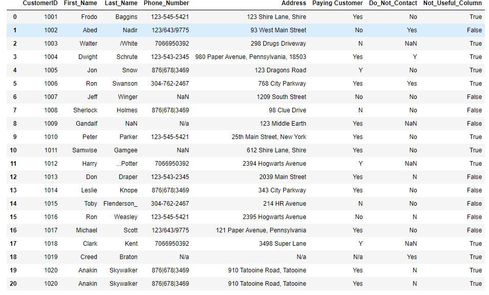
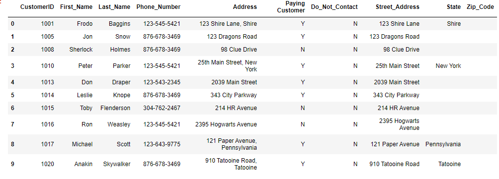

# Data-Cleaning-In-Pandas


## Project Overview
This analysis focuses on creating a targeted call list for the sales team to support an upcoming marketing campaign. The initial dataset was unstructured and required significant cleaning and refinement to produce an efficient and streamlined list of customers to contact.

I was motivated to carry out this project to showcase my data cleaning skills using pandas. Through this project, I aimed to transform messy, raw data into a valuable asset that could directly contribute to a more focused and data-driven sales strategy.


<!---->

<p align="center">
  
</p>

### Data Source and Tools Used
The dataset used in this project is a fictional one provided by Alex the Analyst, a YouTube content creator known for his data analysis tutorials. For the entirety of this project, I relied on pandas to handle the data cleaning process.

The dataset presented several common issues, including missing values, unwanted characters in the customer name column, inconsistent data formatting across multiple columns, and phone numbers stored in the wrong format. These issues made the data unsuitable for analysis, requiring extensive cleaning before it could be used effectively to generate a targeted call list.

### Data Cleaning
The following are the data cleaning steps taken from start to end to obatined the required call list.
1. Loading the data
2. Checking for duplicates and removing duplicates
3. Removing unwanted columns
4. Fixing Datatypes
5. Handling Missing values

#### Loading the Data
```python
import pandas as pd

df = pd.read_csv('Customer Call List.xlsx')
df.head()
```
After loading the data I carried out some data exploration to understanding the data contents
```python
df.info()
```

```python
df.shape
```
#### Checking for duplicates and Removing duplicates
```python
df.duplicated().sum()
```
The data returned one duplicate value, which I proceeded to drop
```python
df = df.drop_duplicates()
```
#### Removing the unnecessary column(s)
Considering what the report is going to be used for, I removed columns that are not necessary. The only columns necessary are CustomerID, FirstName,LastName,Phone_Number,Address, PayingCustomer and DoNotContact
```python
df = df.drop(columns = "Not_Useful_Column")
df
```
#### Fixing the Last_Name Column
The Last_Name column contained unwanted characters like _, / and ... on the left and right. I applied the strip("123") method to remove any leading or trailing characters in the string that match the ones inside the quotes. In this case, to strip any leading or trailing 1, 2, 3, ., _, or / from the values in the 'Last_Name' column..

```python
df = df['Last_Name'].str.strip("123._/")
df
```
#### Fixing the Phone Number Column
The phone number column contains unwanted characters such as / and | as shown below


Proceed to clean the Phone_Number column to have all values consistent in the format 123-545-5421 using lamda fnction.

First, format the column to a string

```python
df["Phone_Number"] = df["Phone_Number"].apply(lambda x:str(x))

df["Phone_Number"] = df["Phone_Number"].apply(lambda x:x[0:3] + '-' + x[3:6] + '-'+x[6:10] )
df

```
Lastly, replacing NA values
```python
df["Phone_Number"] = df["Phone_Number"].str.replace('nan--','')

df["Phone_Number"] = df["Phone_Number"].str.replace('Na--','')
df

```
#### Adding Columns
The marketing team may need specific address columns such as State, Street adress and Zip code. I proceed to split the Adress which is delimited by a comma to obtain these additional columns.

```python
df[["Street_Address","State","Zip_Code"]] = df["Address"].str.split(',',2,expand = True)
df
```
#### Fixing the Paying Customer and Do_Not_Contact
These two columns contain NaN values and a mix of Yes, Y, No and N. Using str.replace method to ensure consistency for Yes and No values.

```python
df['Paying Customer'] = df['Paying Customer'].str.replace('Yes','Y')

df['Paying Customer'] = df['Paying Customer'].str.replace('No','N')

df['Do_Not_Contact'] = df['Do_Not_Contact'].str.replace('Yes','Y')

df['Do_Not_Contact'] = df['Do_Not_Contact'].str.replace('No','N')

df
```
#### Fixing NA values across the dataset

```python
df = df.replace('N/a','')
df = df.fillna('')
df
```

#### Valid Call list
We need to provide the client with a list that only contains customers they can call. The Do_Not_Contact column indicates whether a customer should be contacted or not. Using a loop to drop those customers that should not be contacted from the list.

```python
for x in df.index:
    if df.loc[x,"Do_Not_Contact"] == 'Y':
        df.drop(x, inplace = True)
```
Then proceed to drop those customers without phone numbers

```python
for x in df.index:
    if df.loc[x,"Phone_Number"] == '':
        df.drop(x, inplace = True)
        
#Alternatively

df = df.dropna(subset = "Phone_Number", inplace = True)
```
#### Bringing it all up together
Lastly, resetting the index before the providing the final call list to the client

```python
df = df.reset_index(drop = True)
df
```
This concludes the Data Cleaning exercise resulting into a clean call list that can be used by the client as shown in the output below.



### Conclusion
Conclusion
This project highlighted the importance of data cleaning in ensuring the quality and usability of a dataset for analysis. By using pandas, I was able to transform an unstructured and inconsistent dataset into a clean and well-organized one, ready for use by the sales team in their upcoming marketing campaign.

In addition to refining my pandas skills, this project reinforced the value of methodical data preparation in enhancing the accuracy and effectiveness of any analysis. Looking ahead, I plan to apply these skills to more complex datasets and explore additional features of pandas to further optimize the data cleaning process.


